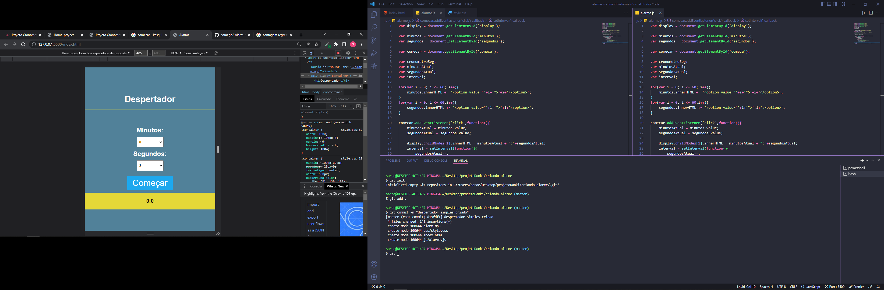

<h1> Estudo-front-html-css-javaScript</h1>

<h2>Estudos para front-end</h2>

> Status: Despertador simples ⚠️

### este despertador foi criado para melhora e pratica o aprendizado em JS

+ criado um index.html, pasta css e pasta js, para o conteudo fica organizado

### verifica >> <a target="_blank" href="https://cosmic-griffin-12a759.netlify.app"> aqui</a>

